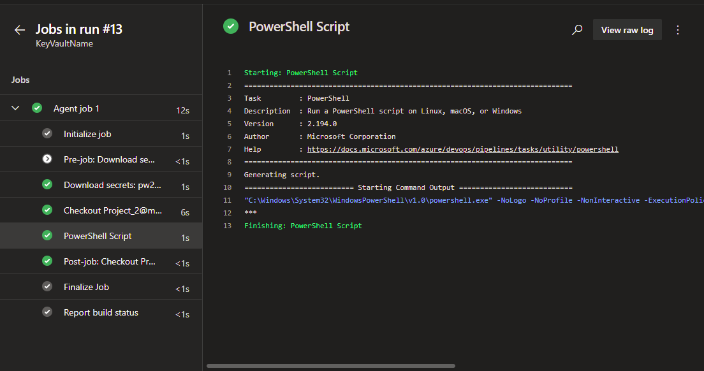
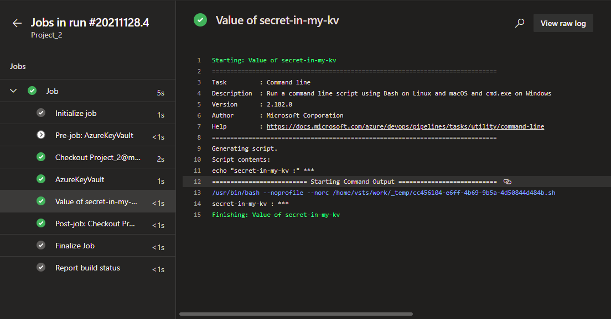

## LAB 09

### Utworzenie resource group

`az group create -n wsb-kv-1 -l westeurope`

### Utworzenie Key Vault

`az keyvault create -n pw26799-kv-1 -l westeurope -g wsb-kv-1`

### Utworzenie sekretu

`az keyvault secret set -n first-secret-in-my-kv --value ThisIsSecretValue --description ‘Moje pierwsze haslo w kv’ --vault-name pw26799-kv-1`

### Polecenie PS do wyświetlenia wartości przechowywanej w Key Vault
`Write-Host $(first-secret-in-my-kv)`



### Przygotowanie pipeline w formie yaml

```
# Starter pipeline
# Start with a minimal pipeline that you can customize to build and deploy your code.
# Add steps that build, run tests, deploy, and more:
# https://aka.ms/yaml

trigger:
- master

pool:
  vmImage: ubuntu-latest

steps:
- task: AzureKeyVault@2
  inputs:
    azureSubscription: 'WSB 2021 (2a518bab-365f-4594-b89a-95f4930f0736)'
    KeyVaultName: 'pw26799-kv-2'
    SecretsFilter: '*'
    RunAsPreJob: false

- script: |
    echo $(secret-in-my-kv)
  displayName: 'Value of secret-in-my-kv'
  ```

  